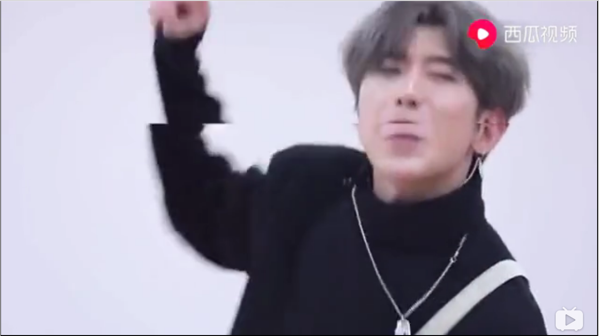
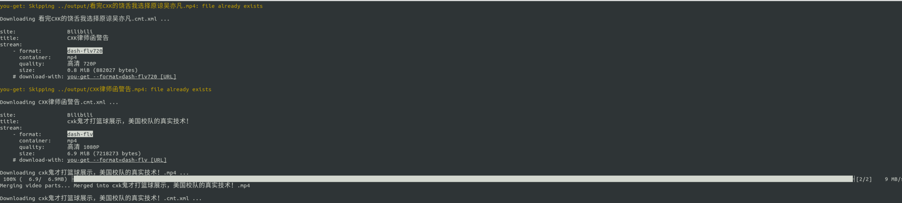
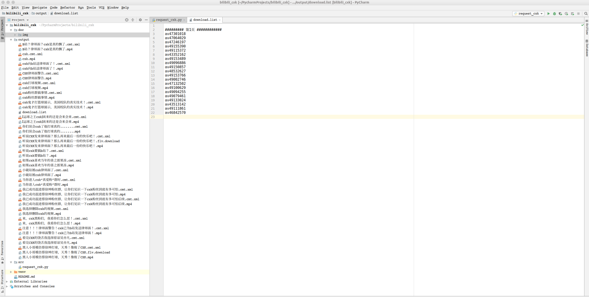

##  bilibili_cxk
### 初识cxk

1. cxk是谁

   `cxk为蔡徐坤中文拼音首字母缩写, 以下摘自百度百科`

   ```
   2012年4月，蔡徐坤因参加综艺节目《向上吧！少年》进入全国200强而进入娱乐圈 [1]；同年8月，参演个人首部偶像剧《童话二分之一》 [2]  。2014年3月，参演个人首部电影《完美假妻168》。2018年1月，参加爱奇艺打造的中国首档偶像男团竞演养成类真人秀《偶像练习生》，并于同年4月6日获得最高票数，以NINE PERCENT九人男团C位出道并担任队长 [3]  ；同年8月，发行个人首张EP《1》 [4]  ；随后获得出道后首个个人音乐类奖项亚洲新歌榜2018年度盛典“最受欢迎潜力男歌手” [5]  ；同年12月，获第十二届音乐盛典咪咕汇年度“最佳彩铃销量歌手”、年度十大金曲《WaitWaitWait》、搜狐时尚盛典“年度人气男明星”以及今日头条年度盛典“年度偶像人物”。2019年2月，首登北京台春晚便包揽词曲，为其创作歌曲《那年春天》 [6]  
   ```

2. cxk 角色点评

   + 国内偶像实习生
   + 篮球职业选手
   + 歌手
   + 舞者
   + 音乐制作人

3. cxk 形象

   `我们来看一下偶像长什么样子`

   

   *oh , no， 放错了, 下面才是我ikun的盛世美颜*


   4. 粉丝爱称

      - ikun

        ```
        ikun，ikun的谐音就是爱坤，也就是ikun们会一直爱着并守护蔡徐坤。
        ```

      - cxk

        ```
        开篇已经描述过了, 蔡徐坤拼音名字缩写
        ```

      - 蔡(菜) -> 徐(虚) -> 坤(鲲)

        `1. 菜`

        ```
        爱打篮球, 打球很菜(bang)
        ```

        `2. 虚`

        ```
        篮球必备 [虚] 晃招式，欧文，哈登都拿这招没办法，曾经在校队掀起腥风血雨。
        ```

        `3. 鲲`

        ```
        鲲，传说中的大鱼，生活在北边幽深的大海--北冥。
        
        鲲在中国古代文献中，记载最早的当属《列子·汤问》。文中说：“终北之北有溟海者，天池也，有鱼焉，其广数千里，其长称焉，其名为鲲。”
        
        稍后的《庄子》也引用了这个传说。庄周在其《庄子－逍遥游》中说：“北冥有鱼，其名为鲲。鲲之大，不知其几千里也。‘’《广韵》古浑切《集韵》《韵会》《正韵》公浑切，音昆。《尔雅·释鱼》鲲，鱼子。《注》凡鱼之子名鲲。《鲁语》鱼禁鲲鲕。《类篇》或作鳏。又《玉篇》大鱼。        
        ```

   5. 成名舞台

      + bilibili

        ```
        哔哩哔哩（bilibili）现为国内领先的年轻人文化社区，该网站于2009年6月26日创建，被粉丝们亲切的称为“B站”。B站的特色是悬浮于视频上方的实时评论功能，爱好者称其为“弹幕”，这种独特的视频体验让基于互联网的弹幕能够超越时空限制，构建出一种奇妙的共时性的关系，形成一种虚拟的部落式观影氛围，让B站成为极具互动分享和二次创造的文化社区。B站目前也是众多网络热门词汇的发源地之一。
        ```

   6. 成名视频截图

      1. 与篮球亲密接吻

         

      2. 虚晃运球

         

      3. 白带引力异常

         

      4. 鸡你太美

         

7. 网友爱 (love and peace) 的点评

   ```
   北海有鲲，体虚无力，海鲨嗜食谓之佳菜，故得名菜虚鲲。进食之时群鲨齐聚，四面围逼，有渔人远眺叹曰：真乃鲨逼菜虚鲲也！
   ```

   ```
   打球菜可以，打球蔡不行
   ```

   ```
   一天，蔡徐坤在拿抹布擦桌子，看到一只.小蚂蚁，于是她儒雅随和的问，小蚂蚁，你的父母呢?怎么只有你一个。小蚂蚁回答:你抹死了！
   ```

   ```
   菜虚鲲是鲲类中的一种，虚弱无力的它们常常被其他鲲捕食，鲲类捕食它们的同时鲨鱼也会逼迫它们进入深海，这个过程有一个凄美的名字，鲨逼菜虚鲲
   ```

   ```
   不给我点赞的打球都想蔡徐坤
   ```

   ```
   当他们黑鹿晗演技的时候，
   我没有跟风；
   因为我不会演戏。
   
   当他们黑吴亦凡说唱的时候，
   我保持沉默；
   因为我不会说唱。
   
   当他们黑蔡徐坤打篮球的时候，
   我要站起来了，
   因为我真的会打篮球。
   ```

   ```
   我觉得骂蔡徐坤的人先去了解一下他，我就是这样之前也不喜欢他，想骂他，但深入了解后，我发现我不仅想骂他，还想打他。
   ```

   ```
   从隔壁大佬那偷来的反向藏头
   有什么好喷的？
   没点逼数吗？
   都闲着没事做吗？
   巴不得别人好吗？
   叽叽歪歪的。
   比一比你们自己有什么资格？
   傻不拉叽的。
   大方点承认别人优秀不行吗？
   一点自知之明都没有。
   是在家闲着没事做了吗？
   就这么对坤坤？
   坤坤有怎么样你们？
   需要你们指手画脚的？
   蔡徐坤是你们能随便抨击的吗？
   ```

   ```
   打篮球罚球的时候，拼命喊蔡徐坤就对了，一定不会进的
   ```

   ```
   鸡长八尺有余，而形貌昳丽。朝服衣冠，窥镜，谓其妻曰：“我孰与城北徐坤美？”其妻曰：“君美甚，徐坤何能及君也？”城北徐坤，齐国之美丽者也。鸡不自信，而复问其妾曰：“吾孰与徐坤美？”妾曰：“徐坤何能及君也？”旦日，客从外来，与坐谈，问之客曰：“吾与徐坤孰美？”客曰：“徐坤不若君之美也。”明日徐坤来，曰：“鸡你太美！“
   ```

   ```
   蔡徐坤，梳中分，花式运球有点昏；
   烟熏妆，护手霜，看他打球心里慌；
   背带裤，增高鞋，裤腰带拴蝴蝶结；
   会唱歌，能跳舞，不知他是公是还母
   ```

   ```
   📞蔡徐坤向您发起了篮球邀请
   
   ↓ 拒绝 丨 ⚪接受
   ```

   ```
   你运球的动作是那么帅气；
   打动了我易感的少女心弦。
   球在你纤手中飘逸地悦动；
   像是被赋予了魔法的灵力。
   蔡琰胡笳不及你一半韵律；
   徐徐春风吹动你棕蓝秀发。
   坤坤，不要理会谣言中伤！
   ```

   ```
   。 鸡你太美
   鸡你实在太美
   鸡你是太美
   鸡你太美
   实在是太美鸡你
   鸡你 实在是太美鸡你 美
   鸡你 实在是太美鸡美 太美
   鸡你 实在是太美鸡美 太美
   鸡你 实在是太美鸡美 太美
   鸡你 鸡你实在是美太美 美蓝球球
   鸡 鸡 鸡你实在是太美 篮球篮球球
   鸡 鸡你太美裆鸡太啊 蓝篮球
   鸡你太美裆裆鸡美
   鸡你美裆 裆鸡美
   鸡太美 鸡太美
   鸡美 鸡美
   鸡美 鸡美
   鸡美 鸡美
   鸡太 鸡太
   金 猴 金猴
   皮 鞋 皮鞋金猴
   金光 金光 大道
   大道
   
   点赞（帅哥美女）
   不点赞（通通cxk）
   ```


### from cxk_lawyer_warning import bilibili

1. [exception事件](https://baijiahao.baidu.com/s?id=1630662936105766533&amp;wfr=spider&amp;for=pc)

   ```
   4月12日，蔡徐坤方发布致B站（哔哩哔哩弹幕网）律师告知函，称B站上存在大量对蔡徐坤表演进行恶意剪辑、诽谤的内容，要求立即删除相关侵权内容并断开侵权链接。其代理律师称，已经整理出4页侵权内容发送至B站，其中包括艺人“换脸”等视频链接。
   ```

2. bilibili 回应

   ```
   4月12日晚，哔哩哔哩弹幕网官方微博发文回应蔡徐坤的律师函，称：“律师函经热心网友转发后已收悉，蔡徐坤先生的感受我们很关注。B站一直重视保护公民的隐私权、名誉权，法律的问题交给专业人士处理，相信法律自有公断。推荐阅读【人民网——看舆论监督中‘公众人物’的名誉权问题】。”还在文末附上了一篇关于公众人物名誉权问题的文章。
   ```

### print(repo.purpose)

1. 为了防止b站会把给大家带来欢乐的idol的视频给屏蔽掉，本宝宝觉得很有义务把b站有关cxk的视频爬取下来，收藏一下。
2. 稍微了扩展了一下，可以在命令行输入其他关键字。

### running script

1. 依赖

   + python3
   + pip3
   + you_get
   + bs4

2. 执行

   ```
   python3 request_cxk.py {查询关键字} {需要下载到的页数}
   ```

   ​	`eg: python3 request_cxk.py cxk 1` *即搜索关键字cxk， 只要下载查询出来的1页的视频* 

   ​	`{需要下载到的页数}可以不用填写，默认为搜索出来的总的页数`

3. 效果

   `下载好的视频生成在output文件夹当中, 其中download.list表示下载的av_id,貌似视频还自带了弹幕?`

   

   